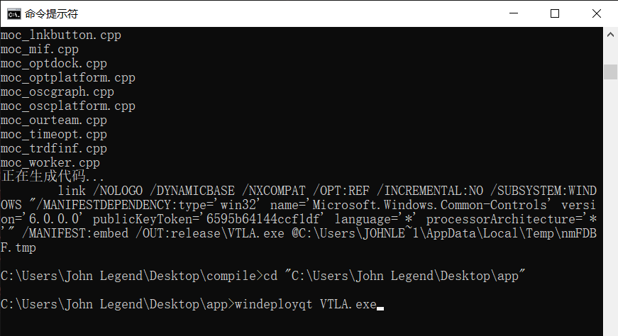

## 软件编译文档

### 编译运行平台:

Windows 10

### 编译工具：

**Qt SDK +  VS2017套件**

**Qt SDK下载：**  [qt-opensource-windows-x86-5.14.0.exe](https://download.qt.io/official_releases/qt/5.14/5.14.0/qt-opensource-windows-x86-5.14.0.exe)

（5.14.0版本，安装时要勾选msvc2017 64-bit组件）

**Visual Studio 2017下载：**百度  

###编译过程

**1、在桌面下新建一个文件夹命名为compile，将 \src下的 C++ Header File目录 ，C++ Source File目录 , Image目录及ProFile目录 这几个目录下的所有文件复制到compile文件中（不包含文件夹）**

**2、找到Qt安装目录下 D:\Qt\Qt5.14.0\5.14.0\msvc2017_64\bin\qtenv2.bat 批处理文件**

  
**3、找到VS2017的安装目录下 D:\VS2017\VC\Auxiliary\Build\vcvarsall.bat 批处理文件**

 

**4、运行cmd, cd到qtenv2.bat所在目录，命令行中输入“qtenv2.bat”, 此时qmake.exe会被添加到环境变量**

**5、cd到vcvarsall.bat所在目录，命令行中输入 "vcvarsall.bat x86_amd64", 此时编译环境会自动被配置好**
 

**6、"cd /d ..\Desktop\compile" 将当前目录切换至compile目录，命令行中先后运行qmake，nmake命令，此时生成了可执行文件VTLA.exe**

**7、在英文路径下另外新建一个文件夹（此处名字为app），将VTLA.exe复制到此目录下，并在命令行中用cd命令将当前目录切换至此目录，输入"windeployqt VTLA.exe"，此时生成程序的依赖项**

**8、将\src 下的\_jsp\_，\_html\_，\_css\_，grid，jsonSet这5个目录（文件夹及里面的文件）和 bgm.mp3、 dataIndex.dat、 dataSet.dat这3个文件 复制到刚新建的目录下，此时双击VTLA.exe即可正常运行**

